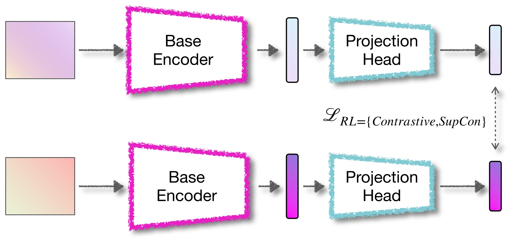
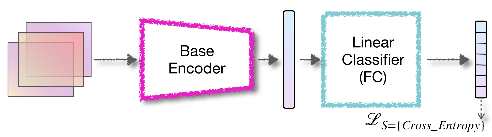
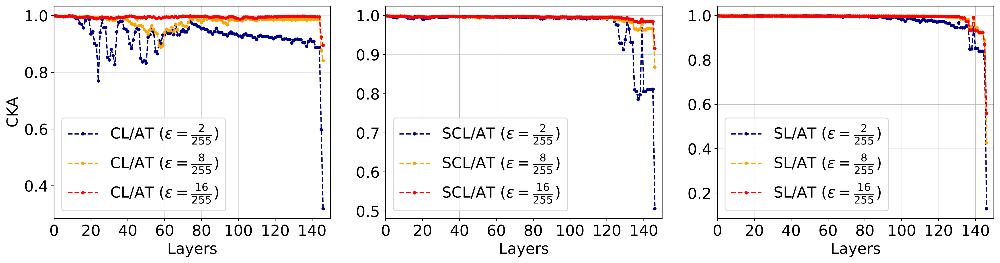
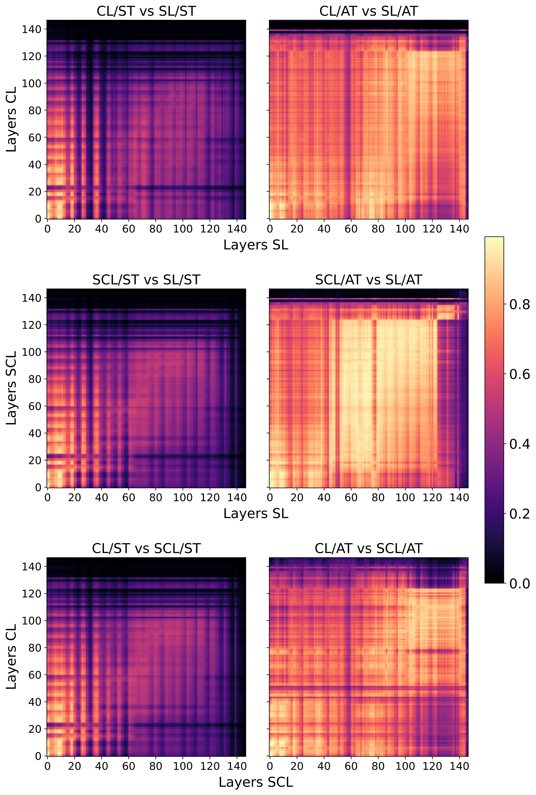

# CL-Robustness
Our goal is to understand whether there are differences in how contrastive learning learns the representation from data compared to supervised learning from the adversarial perspective. To this end, we conduct extensive experiments to evaluate the robustness of the following learning schemes:

- Contrastive Learning (CL): Within the standard framework of SimCLR, contrastive learning trains a base encoder by minimizing a contrastive loss over the representations projected into a latent space (Figure 1(a)). The extracted features will be employed to train a linear classifier on a downstream task as shown in Figure 1(a).
- Supervised Contrastive Learning (SCL): A supervised extension of contrastive learning  to avoid false positive pairs selection by leveraging the label information.
- Supervised Learning (SL): The network consists of a base encoder followed by a fully connected layer as a linear classifier, as shown in figure 1(b). In this case, cross entropy between the true and predicted labels is utilized for training the network parameters.

The training process in contrastive and supervised contrastive learning includes the following two phases:

- Pretraining Phase: The goal of this phase is to train the base encoder parameters by minimizing a self-supervised loss over a given dataset.

- Supervised Fine-tuning Phase: 
The goal of this phase is to train the linear classifier parameters by minimizing the supervised loss over a labeled dataset.
The linear classifier learns to map the representations extracted during the pretraining phase to the labeled space, where its loss is the cross-entropy loss.

We examine the standard and robust training variations of the aforementioned training phases to compare the adversarial robustness across different learning schemes. Table 1 summarises all the studied training combinations for different possible scenarios of training phases in contrastive and supervised contrastive learning schemes.

## An overview of the methodology
<p align="center">

 <br>
 <em><strong>Figure 1(a) Contrastive and Supervised Contrastive Learning.</strong></em>
</p>

<p align="center">

  <br>
  <em><strong>Figure 1(b) Supervised Learning.</strong></em>
</p>

<div align="center">

| Scenarios   | Pretraining Phase    | Finetuning Phase          |
|-------------|----------------------|---------------------------|
| ST          | Standard Training    | Standard Training         |
| AT          | Adversarial Training | Standard Training         |
| Partial-AT  | Adversarial Training | Partial Adversarial Training |
| Full-AT     | Adversarial Training | Full Adversarial Training   |
<br>
<em><strong>Table 1: Summary of the training scenarios.</strong></em>  
</div>

## Running

#### Contrastive and Supervised Contrastive Learning
(1) ST Scenario
```
python cl_scl_ST.py
 ```
 (2) AT Scenario
```
python cl_scl_AT.py
 ```
 (3) Partial AT Scenario
```
python cl_scl_PAT.py --scenario AT-Partial-AT
 ```
 (4) Full AT Scenario
```
python cl_scl_FAT.py --scenario AT-Full-AT
 ```
 #### Supervised Learning
(1) ST Scenario
```
python sl_ST.py
 ```
 (2) AT Scenario
```
python sl_AT.py
```
 #### Semi-Supervised Learning
(1) ST Scenario
```
python semi-cl-scl-sl.py
 ```

## Representation Analysis
We compute the similarity of representations across all layer combinations in standard-trained networks that have been trained using different learning schemes, considering both clean and adversarial data. The three learning schemes (SCL, SL, and CL) have noticeable differences in their internal representation structures (Figure 3, the first column). CL demonstrates more consistent representations throughout the network when compared to SCL and SL. Moreover, standard-trained networks exhibit substantial dissimilarity between clean and adversarial representations (Figure 3, the first column vs. the second one).

<p align="center">

  <br>
 <em><strong>Figure 2: The representations obtained from standard-trained networks exhibit significant differences between adversarial and clean examples, regardless of the learning algorithm utilized.</strong></em>
</p>


We analyze robust models by comparing layer pairs within different learning schemes and calculating their CKA similarity on clean and adversarial examples. Linear probing is employed to gain insights into the network dynamics and the roles of intermediate layers. The results demonstrate amplified cross-layer similarities compared to standard training, indicated by higher brightness levels in the plots. Additionally, networks trained through adversarial training exhibit significant similarities between adversarial and clean representations. Moreover, upon comparing the representations obtained from AT and its counterpart Full AT, we observe a significant enhancement in long-range similarities within CL. This improvement in similarity leads to substantial improvements in both standard and adversarial accuracy. In contrast, the representations learned by SCL and SL under AT and Full AT scenarios exhibit slight differences, resulting in minor variations in their performance.
<p align="center">

 <br>
 <em><strong>Figure 3: The similarity between adversarial and clean representations is substantial in adversarially trained networks, regardless of the learning scheme used.</strong></em>  
</p>
Improving the similarity between adversarial and clean representations enhances robustness. During adversarial training, we increased perturbation budgets to vary the strength of adversarial attacks. This led to greater similarity between adversarial and clean representations, especially towards the end of the network.

<p align="center">

 <br>
 <em><strong>Figure 4: Increasing the similarity between adversarial and clean representations improves robustness, especially near the end of networks.</strong></em>  
</p>


The cross-model CKA heatmap between standard-trained networks trained using different learning schemes highlights that these schemes extract distinct adversarial representations, particularly in a large number of higher layers within the network. Cross-model comparisons demonstrate that, after applying adversarial training, the similarity between layers from different learning schemes increases, suggesting a shift towards extracting a universal set of representations.

<p align="center">

  <br>
 <em><strong>Figure 5: Unlike standard-trained networks, the ones trained through adversarial training show significant similarity in adversarial representations across different learning schemes.</strong></em> 
</p>


