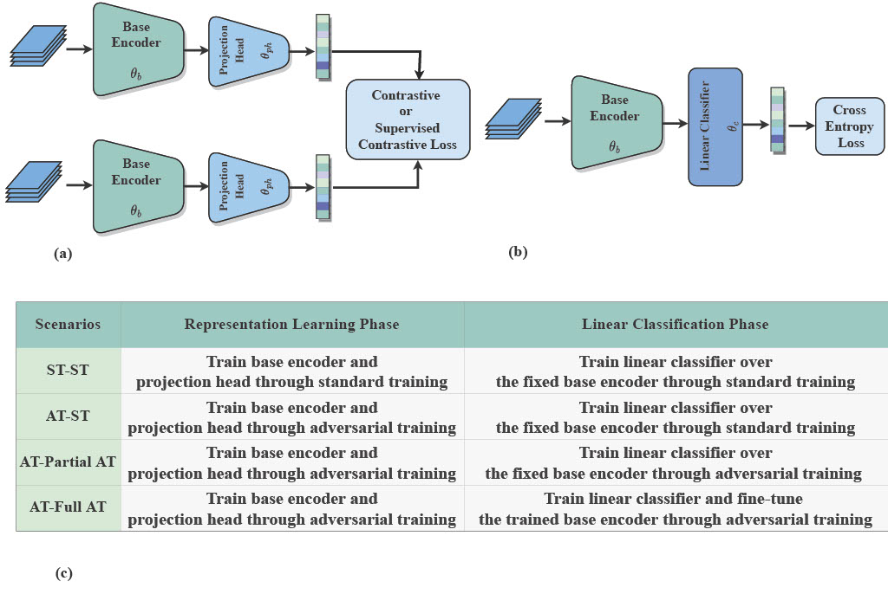

# CL-Robustness
In this work, we take a comparative approach to study the robustness of contrastive learning schemes against adversarial attacks. To this end, we conduct several comprehensive experiments to compare the robustness of contrastive and supervised contrastive with standard supervised learning under different adversarial training scenarios (Figure 1(c)). We conduct our comparative study on the robustness of the three following learning schemes,

- Supervised Learning (SL): The network consists of a base encoder followed by a fully connected layer as a linear classifier, as shown in figure 1(b). In this case,
cross entropy between the true and predicted labels is utilized for training the network parameters.
- Contrastive Learning (CL): Within the standard framework of SimCLR, contrastive learning trains a base encoder by minimizing a contrastive loss over the representations projected into a latent space (Figure 1(a)). The extracted features will be employed to train a linear classifier on a downstream task as shown in Figure 1(a).
- Supervised Contrastive Learning (SCL): A supervised extension of contrastive learning  to avoid false positive pairs selection by leveraging the label information.

## An overview of the methodology

###### a) Representation learning phase, b) Linear classification phase, c) All different scenarios of training phases in contrastive and supervised contrastive learning scheme.

## TSNE Visualization

###### Semi-supervised learning schemes (SL-CL and SCL-CL) separate classes much more clearly than contrastive learning (CL) scheme.

## Representation Visualization

###### Top: CKA between the individual layers of networks trained by CL, SCL, and SL schemes through different scenarios. Bottom: Linear probe accuracy for each layer after residual connections. By comparing the CKA matrices through standard training (the first row) with the ones through adversarial training, we can see the emergence of more block structures in adversarial training scenarios, which means having more similar representations between layers. The results on the second row show the block structure is highly reduced in CL scheme after full fine-tuning or in AT-full AT scenario. Linear probe accuracies for learned representations also prove this finding.
