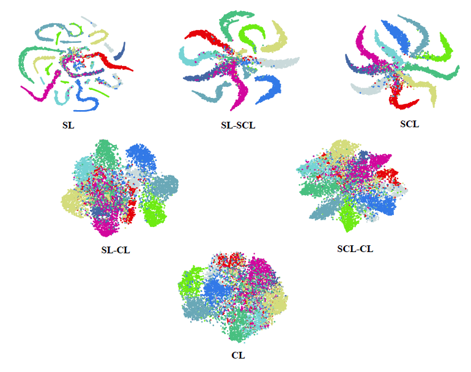
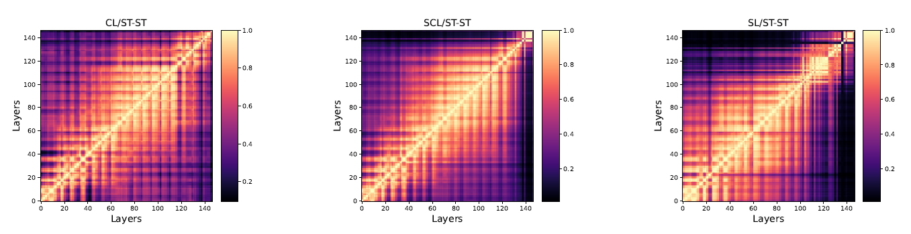
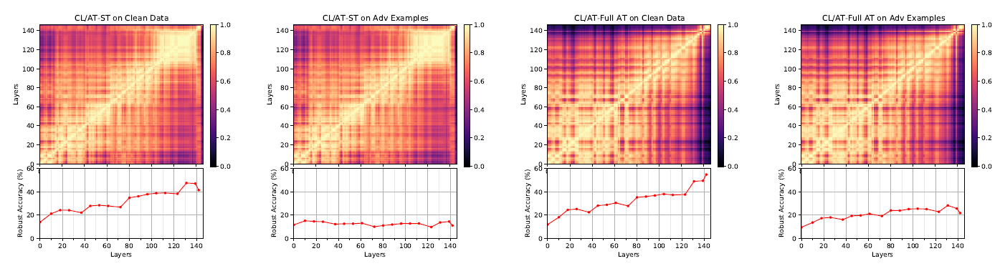
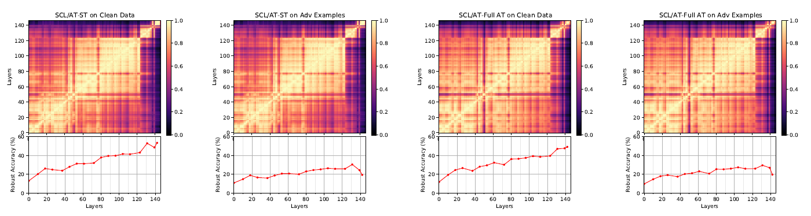
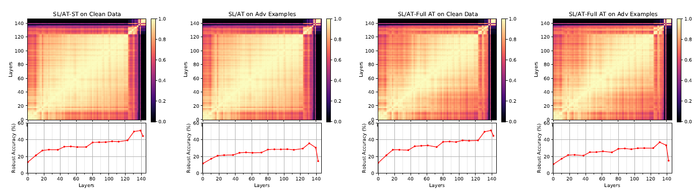

# CL-Robustness
In this work, we take a comparative approach to study the robustness of contrastive learning schemes against adversarial attacks. To this end, we conduct several comprehensive experiments to compare the robustness of contrastive and supervised contrastive with standard supervised learning under different adversarial training scenarios (Figure 1(c)). We conduct our comparative study on the robustness of the three following learning schemes,

- Supervised Learning (SL): The network consists of a base encoder followed by a fully connected layer as a linear classifier, as shown in figure 1(b). In this case,
cross entropy between the true and predicted labels is utilized for training the network parameters.
- Contrastive Learning (CL): Within the standard framework of SimCLR, contrastive learning trains a base encoder by minimizing a contrastive loss over the representations projected into a latent space (Figure 1(a)). The extracted features will be employed to train a linear classifier on a downstream task as shown in Figure 1(a).
- Supervised Contrastive Learning (SCL): A supervised extension of contrastive learning  to avoid false positive pairs selection by leveraging the label information.

###### Figure 1: An overview of the methodology. a) Representation learning phase, b) Linear classification phase, c) All different scenarios of training phases in contrastive and supervised contrastive learning scheme.

## TSNE Visualization

## Representation Visualization

